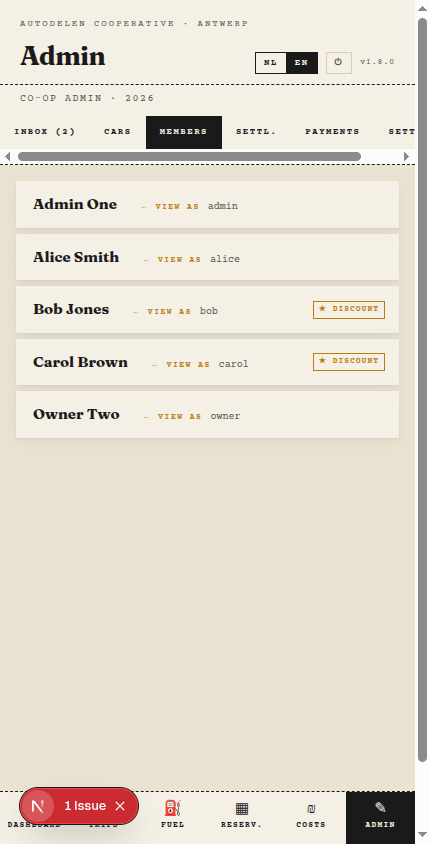

# Admin Guide

This guide covers the pages that are only visible to **admins** (not regular car owners).

> Car owner pages (Inbox, Cars, Settlements) are documented in the [Owner Guide](owner-guide.md).

---

## 1. Members

The Members page (`Admin → Members`) lists all registered members. Only admins can access this page — car owners cannot see it.

Click a member row to expand it and edit their details:

| Field                  | Description                                |
| ---------------------- | ------------------------------------------ |
| **Username**           | Login name for the member                  |
| **Admin**              | Toggle to grant or revoke admin privileges |
| **Base discount**      | Discount % applied to trips ≤ 500 km       |
| **Long-trip discount** | Discount % applied to trips > 500 km       |

### Generating an invite link

Click **Copy invite link** inside an expanded member row to copy a one-time invite URL to your clipboard. Send it to the member — they use it to set their password and log in for the first time.

The link is valid for 7 days. Generate a new one if it expires.

### View as member

Click **View as** next to any member to log in as them. Useful for troubleshooting what a member sees. Switch back by logging out and logging in as yourself.

---

## 2. Payments

The Payments page (`Admin → Payments`) is where you record money that members have actually transferred to the cooperative's bank account.

After a settlement is finalized, members with a negative balance owe money. As those transfers arrive, log them here so the settlement page can track what is still outstanding.

### Adding a payment

Click **+ Add**, then fill in:

| Field      | Description                                      |
| ---------- | ------------------------------------------------ |
| **Person** | The member who made the payment                  |
| **Date**   | Date the transfer was received                   |
| **Amount** | Amount in euro                                   |
| **Note**   | Optional — e.g. bank reference or partial reason |

Click **Save**. The payment is linked to the settlement year matching the payment date and updates the outstanding-transfers count on the Settlement page.

### Editing or deleting a payment

Each payment row has an edit and delete button. Use delete only to correct a data entry error — not to reverse a real transfer.

---

## 2. Settings

The Settings page (`Admin → Settings`) has two sections.

### Cooperative bank account

Enter the IBAN of the cooperative's bank account. This is inserted automatically into the payment messages that the Settlement page generates for members, so they know where to transfer money.

### Google Calendar integration

If you want approved reservations to appear in a shared Google Calendar, configure the integration here:

| Field                   | Description                                                |
| ----------------------- | ---------------------------------------------------------- |
| **Google Calendar ID**  | The calendar ID from Google Calendar settings              |
| **OAuth Refresh Token** | A long-lived token that lets the app write to the calendar |

After saving, click **Test connection** to verify the credentials are working. If the token expires, paste a new one here without touching any other settings.

Leave both fields empty to disable the calendar integration.

---

> Looking for car owner documentation? See the [Owner Guide](owner-guide.md).
