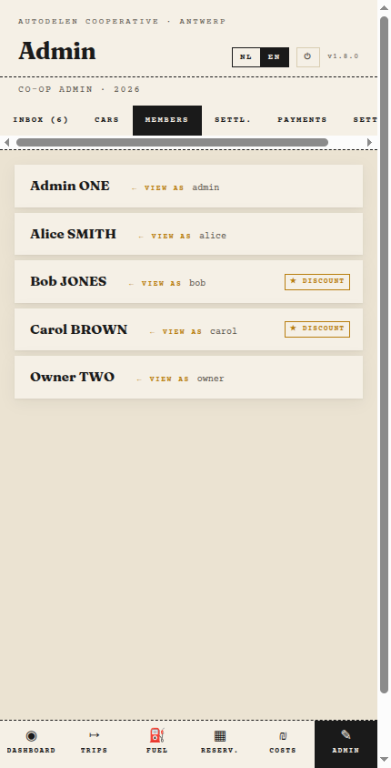
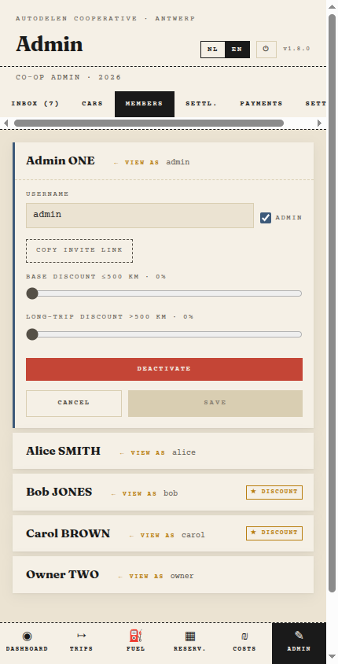
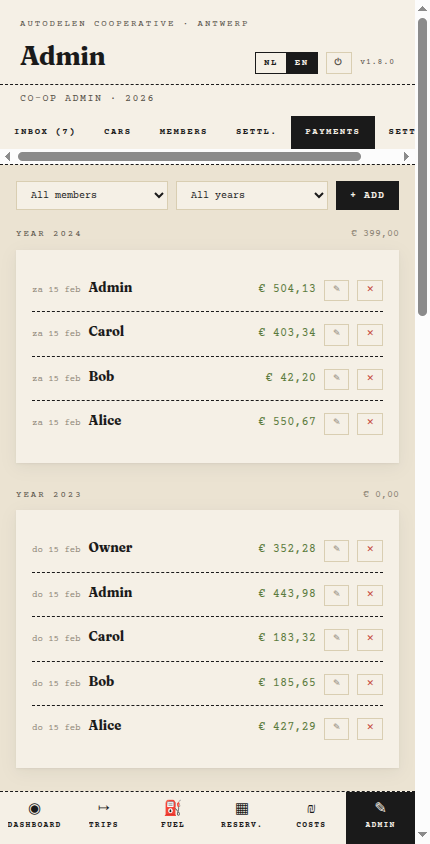
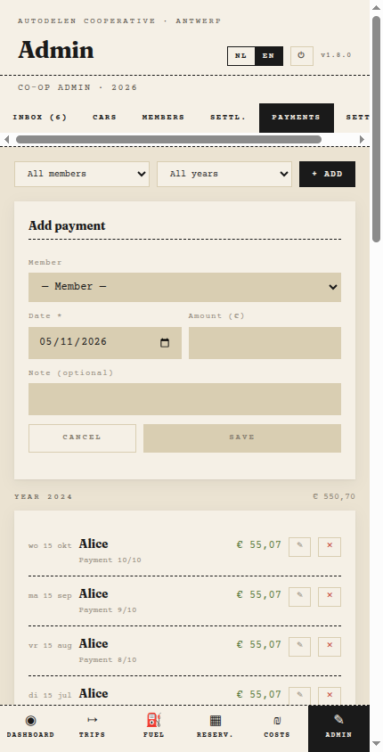
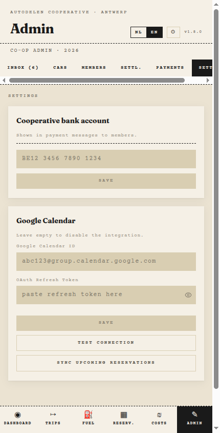

# Admin Guide

This guide covers the pages that are only visible to **admins** (not regular car owners).

> Car owner pages (Inbox, Cars, Settlements) are documented in the [Owner Guide](owner-guide.md).

---

## 1. Members

The Members page (`Admin → Members`) lists all registered members. Only admins can access this page — car owners cannot see it.



Each row shows the member's name, username, and a **View as** link. Members with an active discount show a **Discount** badge.

### Editing a member

Click a row to expand it:



| Field                  | Description                                          |
| ---------------------- | ---------------------------------------------------- |
| **Username**           | Login name for the member                            |
| **Admin**              | Toggle to grant or revoke admin privileges           |
| **Base discount**      | Discount % applied to trips ≤ 500 km (slider 0–50 %) |
| **Long-trip discount** | Discount % applied to trips > 500 km (slider 0–75 %) |

Click **Save** to apply changes. Click **Cancel** to discard.

### Deactivating a member

Click **Deactivate** inside an expanded row to remove the member from active use. Deactivated members appear in a separate **Inactive** section at the bottom of the list. Click **Activate** on an inactive row to restore them.

### Generating an invite link

Click **Copy invite link** inside an expanded member row to copy a one-time invite URL to your clipboard. Send it to the member — they use it to set their password and log in for the first time.


The link is valid for 7 days. Generate a new one if it expires.

### View as member

Click **← View as** next to any member to log in as them. Useful for troubleshooting what a member sees. Switch back by logging out and logging in as yourself.

---

## 2. Payments

The Payments page (`Admin → Payments`) is where you record money that members have actually transferred to the cooperative's bank account.

After a settlement is finalized, members with a negative balance owe money. As those transfers arrive, log them here so the settlement page can track what is still outstanding.



Payments are grouped by year. The year header shows the total amount received for that period.

### Adding a payment

Click **+ Add**, then fill in the form:



| Field          | Description                                      |
| -------------- | ------------------------------------------------ |
| **Member**     | The member who made the payment                  |
| **Date**       | Date the transfer was received                   |
| **Amount (€)** | Amount in euro                                   |
| **Note**       | Optional — e.g. bank reference or partial reason |

Click **Save**. The payment is linked to the settlement year matching the payment date and updates the outstanding-transfers count on the Settlement page.

### Editing or deleting a payment

Each payment row has an edit (pencil) and delete (×) button. Use delete only to correct a data entry error — not to reverse a real transfer.

---

## 3. Settings

The Settings page (`Admin → Settings`) has two sections.



### Cooperative bank account

Enter the IBAN of the cooperative's bank account. This is inserted automatically into the payment messages that the Settlement page generates for members, so they know where to transfer money.

### Google Calendar integration

When configured, approved reservations are automatically pushed to a shared Google Calendar. Car owners receive a personal invite for reservations on their car and can confirm or decline directly from their calendar app — no app login required.

| Field                   | Description                                                |
| ----------------------- | ---------------------------------------------------------- |
| **Google Calendar ID**  | The calendar ID of the shared calendar                     |
| **OAuth Refresh Token** | A long-lived token that lets the app write to the calendar |

After saving, click **Test connection** to verify the credentials are working. If the token expires, paste a new one here without touching any other settings.

Click **Sync upcoming reservations** to push all future confirmed reservations to the calendar immediately — useful after first-time setup or after a token refresh.

Leave both fields empty to disable the calendar integration.

#### Step 1 — Create a Google Cloud project

1. Go to [console.cloud.google.com](https://console.cloud.google.com)
2. Create a new project (e.g. "autodelen")
3. Enable the **Google Calendar API** (APIs & Services → Library → search "Google Calendar API")
4. Go to **APIs & Services → Credentials → Create Credentials → OAuth 2.0 Client ID**
   - Application type: **Web application**
   - Add `https://developers.google.com/oauthplayground` as an authorized redirect URI
5. Copy the **Client ID** and **Client Secret** → add to your `.env.local` and `docker-compose.yml`:
   ```
   GOOGLE_CLIENT_ID=your-client-id
   GOOGLE_CLIENT_SECRET=your-client-secret
   ```

#### Step 2 — Get the shared calendar ID

1. Open [Google Calendar](https://calendar.google.com) with the shared Gmail account
2. In the left sidebar, click the three dots next to the shared calendar → **Settings and sharing**
3. Scroll down to **Integrate calendar** → copy the **Calendar ID** (looks like `abc123@group.calendar.google.com` or a Gmail address for personal calendars)
4. Paste it into the **Google Calendar ID** field in Admin → Settings

#### Step 3 — Generate an OAuth refresh token

1. Go to [OAuth 2.0 Playground](https://developers.google.com/oauthplayground)
2. Click the gear icon (top right) → check **Use your own OAuth credentials** → enter your Client ID and Client Secret
3. In the left panel, find **Google Calendar API v3** → select `https://www.googleapis.com/auth/calendar` → click **Authorize APIs**
4. Sign in with the shared Gmail account that owns the calendar
5. Click **Exchange authorization code for tokens**
6. Copy the **Refresh token** value → paste it into the **OAuth Refresh Token** field in Admin → Settings

#### Step 4 — Complete per-owner setup

For each car owner to receive personal calendar invites:

1. Go to **Admin → Members** → expand the owner's row → set their **email address**
2. Go to **Admin → Cars** → edit each car → set the **Owner** to the correct person

#### Step 5 — Register the webhook (one-time)

The app uses a webhook to receive RSVP responses from owners in real time. Register it once:

```bash
curl -sf -H "Authorization: Bearer $CRON_SECRET" \
  https://autodelen.bluette.be/api/admin/calendar-renew
```

The webhook registration expires every ~4 weeks. A daily cron job on the VPS renews it automatically (see deployment docs). Alternatively, call this endpoint manually after any credentials change.

#### Step 6 — Verify

1. Click **Test connection** in Admin → Settings — should return success
2. Click **Sync upcoming reservations** to backfill existing confirmed reservations
3. Create a test reservation and confirm it — it should appear in the shared Google Calendar within seconds

---

> Looking for car owner documentation? See the [Owner Guide](owner-guide.md).
