# Owner Guide

This guide covers the admin-only pages available to car sharing owners.

> Looking for member documentation? See the [End-user Guide](user-guide.md).
> Looking for admin-only pages (Payments, Settings)? See the [Admin Guide](admin-guide.md).

---

## 1. Inbox

The Inbox collects items that require your attention — primarily **reservation requests** from members, and **odometer gap warnings** where trip odometer readings don't line up.

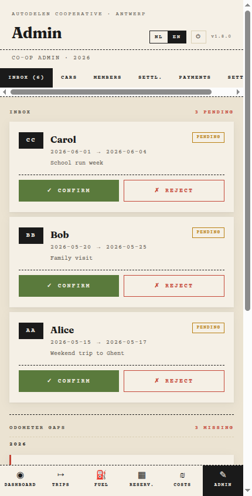

Each reservation request shows:

- Which member submitted it
- The car and date range requested
- A note from the member
- Action buttons: **Confirm** or **Reject**

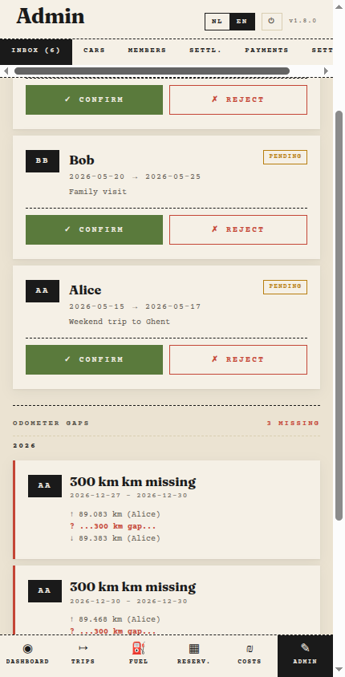

Work through the inbox regularly to keep the calendar and odometer history consistent.

---

## 2. Cars

The Cars page lists all vehicles in the group.

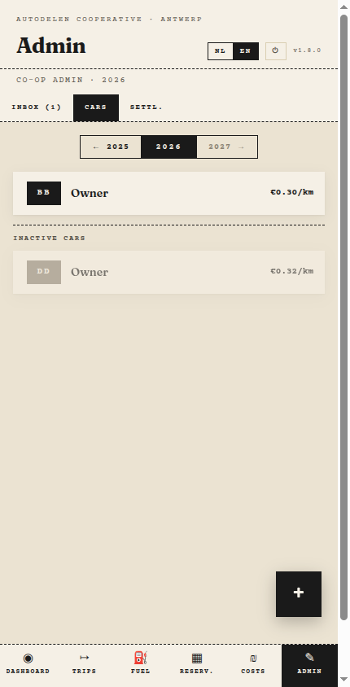

### Adding a car

Click **Add car** and fill in:

| Field            | Description                         |
| ---------------- | ----------------------------------- |
| **Name / plate** | Identifier shown throughout the app |
| **Owner**        | Which member owns this car          |

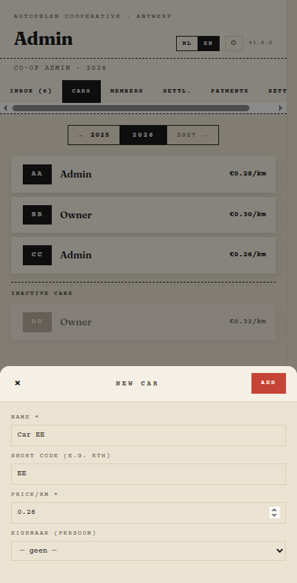

### Editing or removing a car

Click a car in the list to edit its details or remove it.

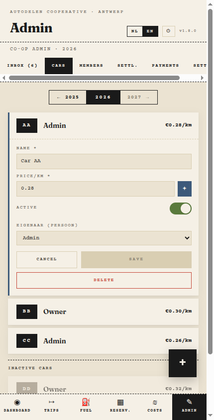

---

## 3. Car overview

Click the **✦** button next to a car's price field (in the car edit form) to open its detail page.

The overview shows:

- **Trips** — total trips, km driven, split between owner and others
- **Fuel** — total fill-ups, litres, and cost split
- **Expenses** — total costs
- **Cost coverage bar** — visual indicator of whether the price/km covers fuel and expense costs
- **Sliders** — simulate different price/km, fuel cost, and km scenarios

Use this page to audit usage and verify that the price/km is set correctly before running a settlement.

---

## 4. Settlements page

The Settlements page calculates who owes what and generates the payment instructions for all members.

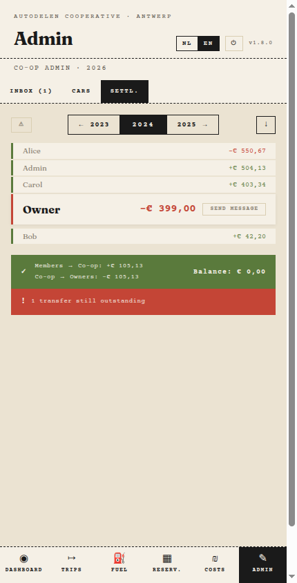

### How settlements work

At the end of a period (typically a year), the app calculates each member's:

- Total km driven
- Fuel costs paid
- Expenses paid
- Share of total costs

The difference between what each person paid and what they owe determines their net balance. Members with a positive balance receive money; members with a negative balance pay.

### Reading the settlement table

Each member row shows their net balance for the period. A **positive** amount means the member receives money; a **negative** amount means they owe money.

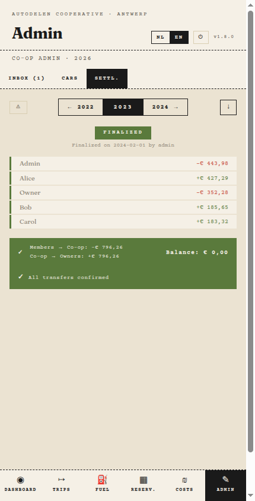

The green summary box at the bottom confirms that inflows and outflows balance to zero.

### Transfers

The red box shows the number of transfers still outstanding. The app calculates the minimal set of payments needed to settle all balances. Open settlements show a **Finalize settlement** button at the bottom.

### Sending settlement messages

Click **Send message** next to a member row to copy a pre-filled payment message to your clipboard. Send it to the member via your preferred channel.

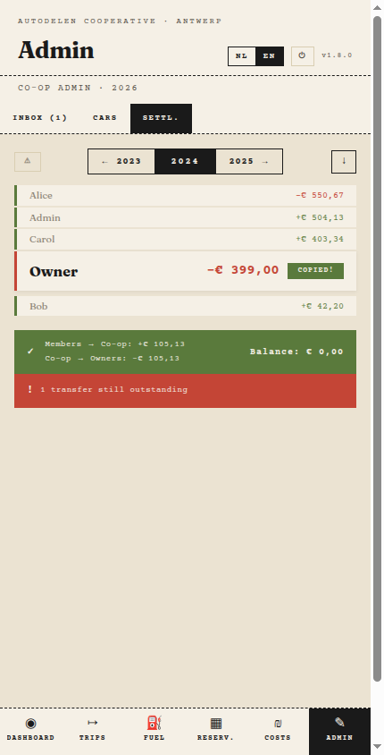

### Locking a settlement

Once all transfers are confirmed, click **Finalize settlement** to close the period. Finalized settlements are archived and excluded from future calculations. A finalized settlement can be reopened with **Reopen settlement** if corrections are needed.

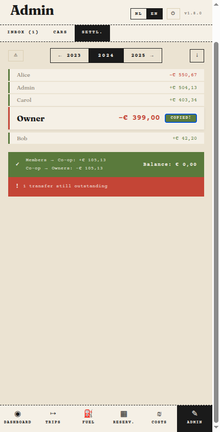

### Year navigation bar controls

Two extra buttons appear in the year navigation bar when settlement data is loaded:

- **Top-left ⚠ / ≡ button** — toggles between two views:
  - **⚠ (default)**: only cards with problems (outstanding or unconfirmed transfers) are shown as expandable. Fully-paid members appear as compact rows.
  - **≡ (show all)**: every member card is shown in full, including members who have already paid. Use this to review or compare all members at once.
- **Top-right ↓ button** — downloads the settlement summary as a Markdown (`.md`) file. Useful for archiving or sharing outside the app.

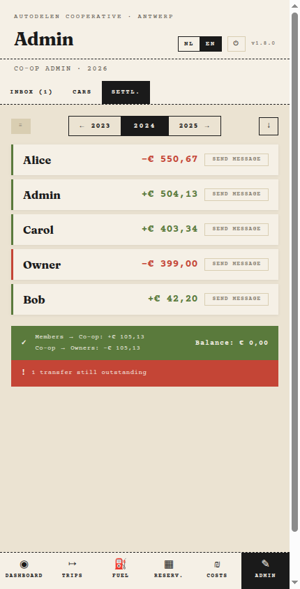

### Member card detail

Click any member's name to expand their card and see a full breakdown of how their balance was calculated:

- **Non-owner members** see a per-car breakdown: km driven, fuel used, and expenses, grouped by vehicle.
- **SALDO** shows the final net amount they owe or are owed.
- **Payment status** shows what has been paid, what is outstanding, and the payment date if confirmed.

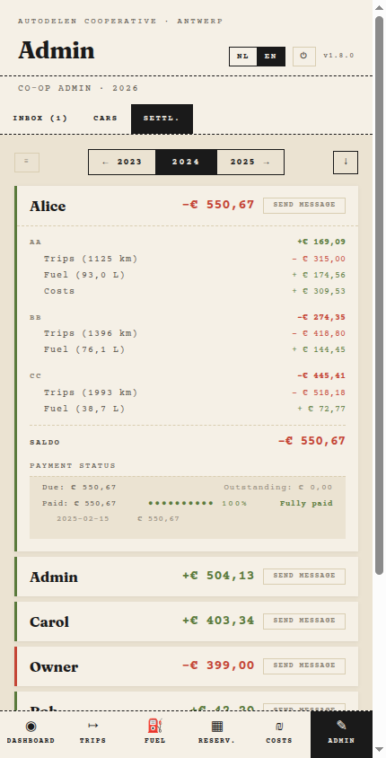

### Owner card detail

Car owners see additional sections in their expanded card:

- **Cross-car trips** (AA, CC, …) — trips driven in cars that belong to other owners. The owner pays their share of those costs.
- **Own car — BB** — the co-op's contribution from members who drove the owner's car. Each member's km, fuel, and expenses are listed individually.
- The owner's own trips in their own car are excluded from the settlement (owner's pocket).

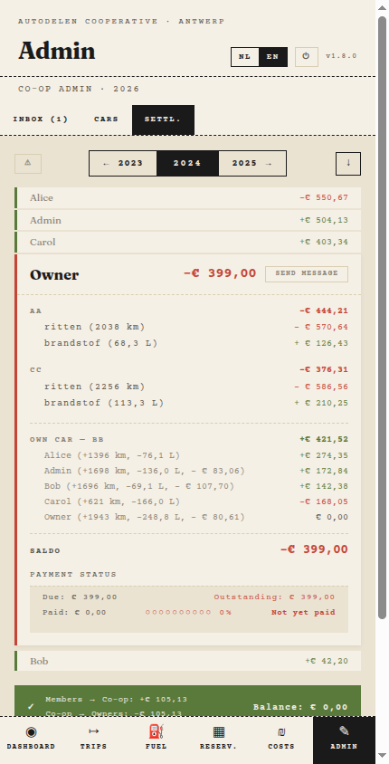
