# Owner Guide

This guide covers the admin-only pages available to car sharing owners.

---

## 1. Inbox

The Inbox collects items that require your attention — typically new trip or fuel entries submitted by members that need review or approval.

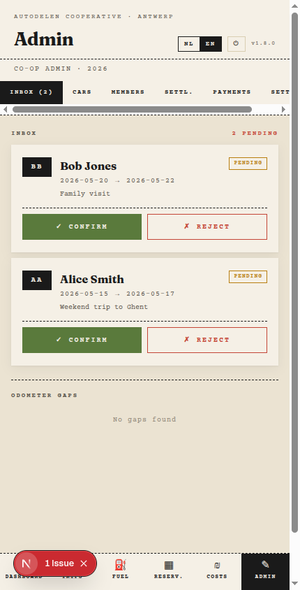

Each inbox item shows:

- Who submitted it
- What type of entry (trip / fuel / expense)
- Date and key details
- Action buttons (approve / reject)

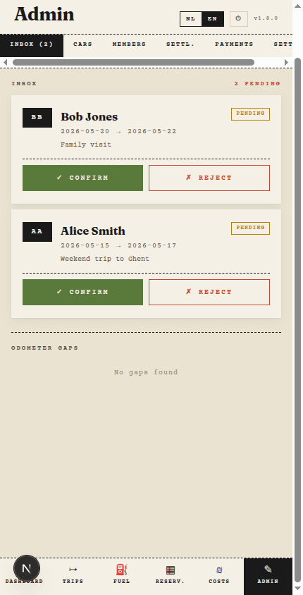

Work through the inbox regularly to keep balances and settlements up to date.

---

## 2. Cars

The Cars page lists all vehicles in the group.

### Adding a car

Click **Add car** and fill in:

| Field | Description |
|---|---|
| **Name / plate** | Identifier shown throughout the app |
| **Owner** | Which member owns this car |

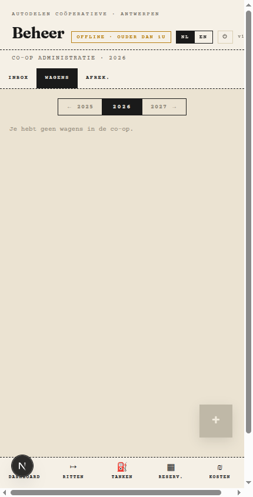

### Editing or removing a car

Click a car in the list to edit its details or remove it.

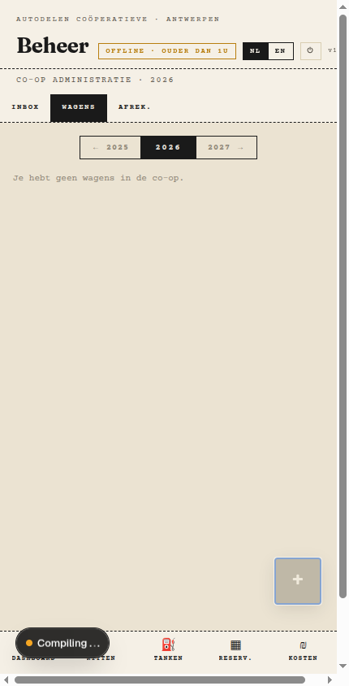

---

## 3. Car overview

Click a car name anywhere in the app to open its detail page.

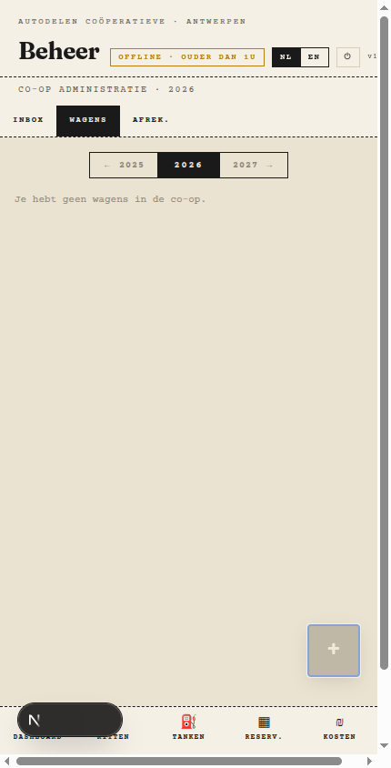

The overview shows:

- **Total km driven** — aggregate across all trips
- **Fuel summary** — total litres and cost
- **Members who used this car** — with their km share
- **Recent trips** — latest entries for this car

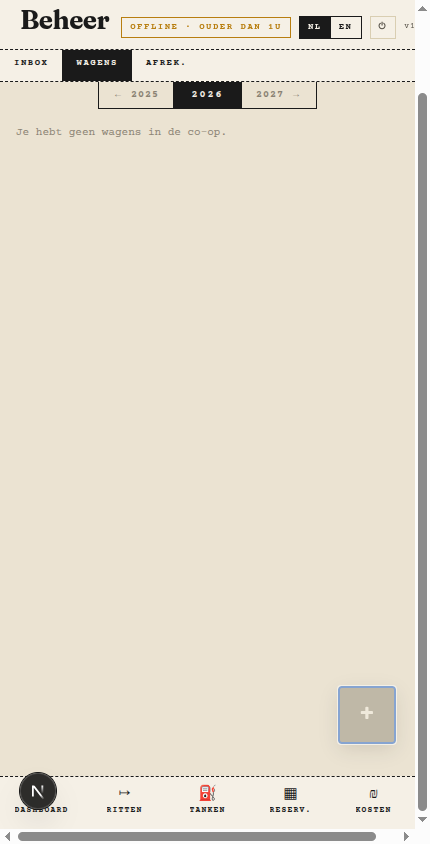

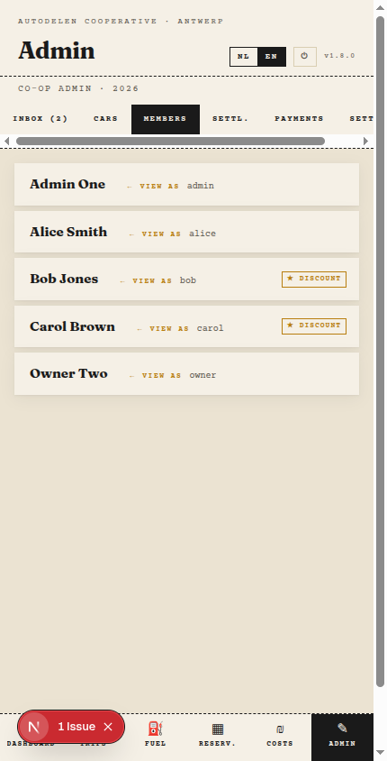

Use this page to quickly audit usage and spot anomalies before running a settlement.

---

## 4. Settlements page

The Settlements page calculates who owes what and generates the payment instructions for all members.

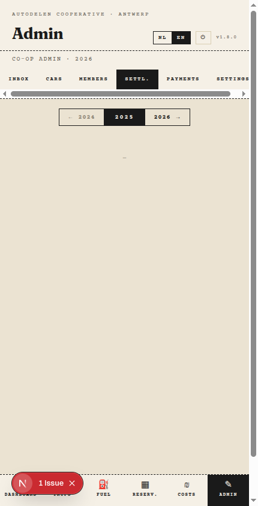

### How settlements work

At the end of a period (typically a year), the app calculates each member's:

- Total km driven
- Fuel costs paid
- Expenses paid
- Share of total costs

The difference between what each person paid and what they owe determines their net balance. Members with a positive balance receive money; members with a negative balance pay.

### Reading the settlement table

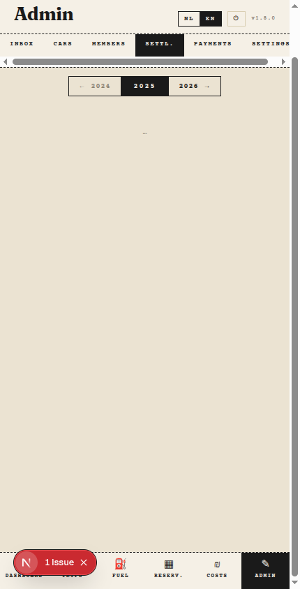

| Column | Meaning |
|---|---|
| **Member** | Name of the member |
| **Paid** | Total amount paid by this member (fuel, expenses) |
| **Owes** | Calculated share of total group costs |
| **Balance** | Paid − Owes (positive = receives, negative = pays) |

### Transfers

The app calculates the minimal set of payments needed to settle all balances.

Each transfer shows: who pays, who receives, and the amount.

### Sending settlement messages

Click **Send message** next to a transfer to generate a pre-filled payment message addressed to the member by full name.

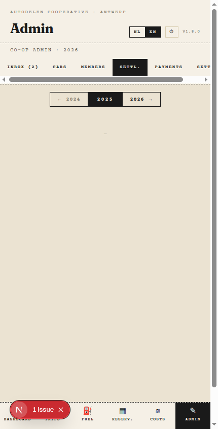

Copy and send the message to the member via your preferred channel.

### Locking a settlement

Once all transfers are confirmed, click **Lock settlement** to close the period. Locked settlements are archived and excluded from future calculations.

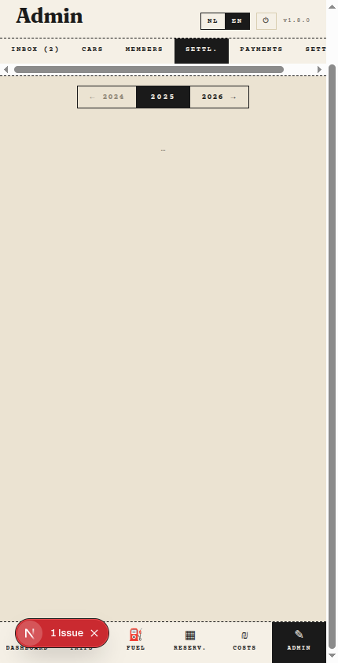
