# End-user Guide

This guide walks you through using the car sharing app as a member — from accepting your invite to logging trips and reading your costs.

> Looking for the car owner documentation? See the [Owner Guide](owner-guide.md).

---

## 1. Accepting your invite

The owner sends you a personal invite link by email or message. Click the link to open the app.

The owner generates this link from the **Members** page in the admin panel — you will receive it directly.

You will land on a login page pre-filled for your account. Set a password and log in.

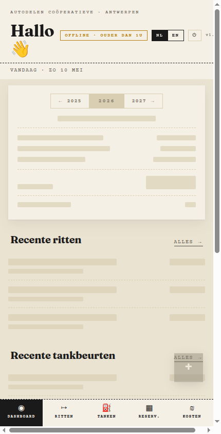

---

## 2. Setting up your profile

After logging in, open your profile via the menu (top-right corner).

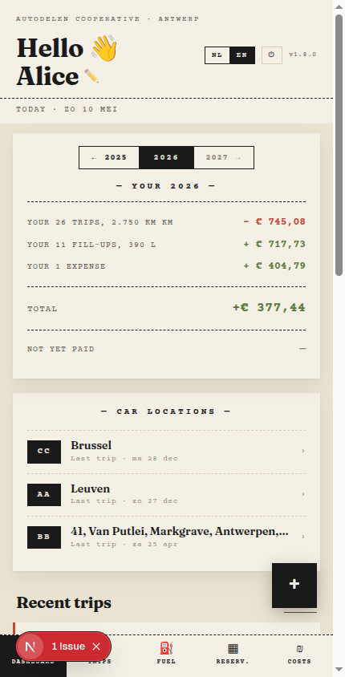

Fill in two required fields:

| Field                   | Why it matters                                 |
| ----------------------- | ---------------------------------------------- |
| **Email address**       | Used for settlement notifications              |
| **Bank account (IBAN)** | Used to send or receive payments at settlement |

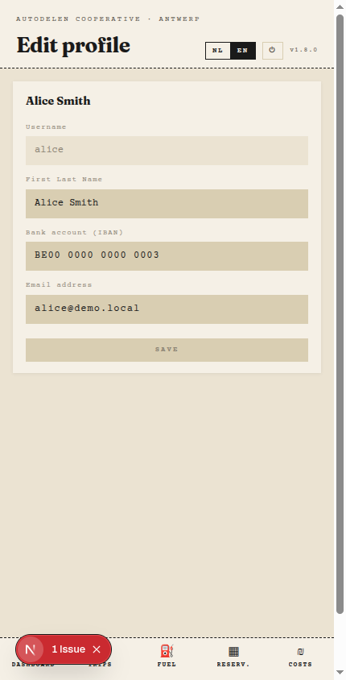

Save your changes. You can update these at any time.

---

## 3. Dashboard

The dashboard is your home page. It shows a summary of recent activity across all cars you have access to.

### What you see

- **Recent trips** — your latest recorded drives
- **Fuel entries** — recent fill-ups
- **Cost summary** — your current balance at a glance

### Filters

Use the filter bar at the top to narrow the view by:

- **Car** — show data for one specific car
- **Date range** — limit to a specific period

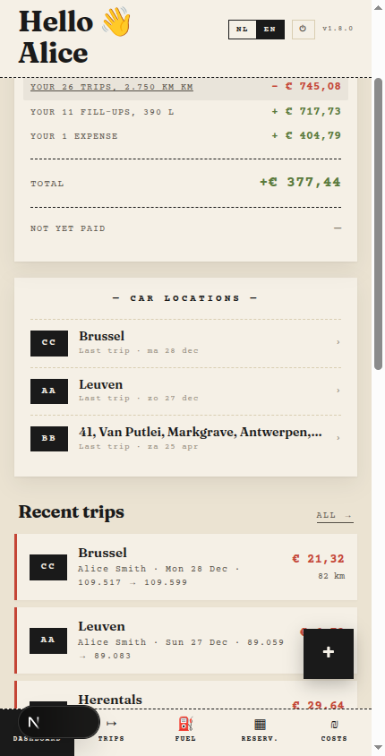

---

## 4. Trips page

The trips page lists all recorded drives.

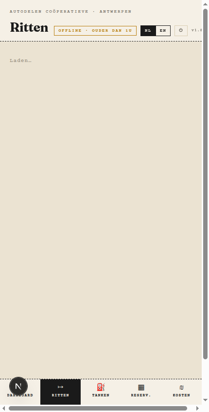

### Filters

| Filter         | Description                     |
| -------------- | ------------------------------- |
| **Car**        | Show trips for one car only     |
| **Driver**     | Show trips by a specific member |
| **Date range** | Limit to a start and end date   |

Each trip card shows: date, driver, car, distance (km), and any notes.

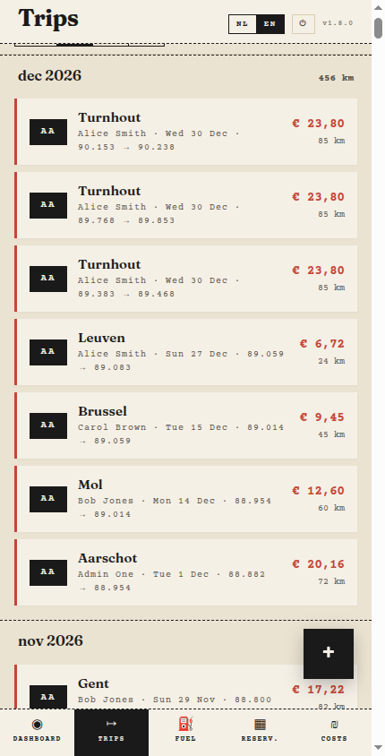

---

## 5. Fuel page

The fuel page lists all recorded fill-ups.

### Filters

| Filter         | Description                        |
| -------------- | ---------------------------------- |
| **Car**        | Show fuel entries for one car only |
| **Date range** | Limit to a start and end date      |

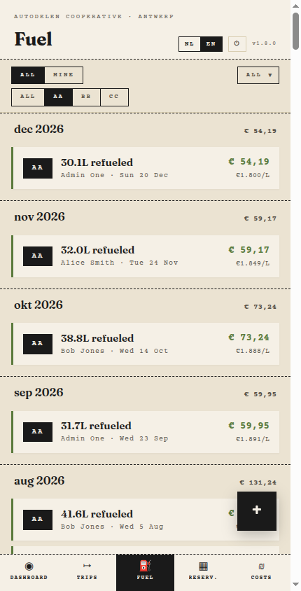

Each fuel entry shows: date, car, litres, price per litre, total cost, and who paid.

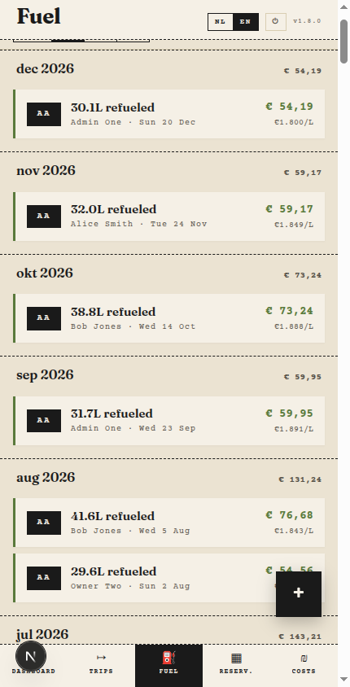

---

## 6. Cost page

The cost page breaks down what you owe or are owed.

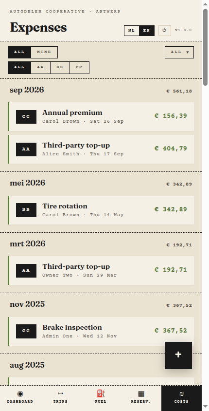

Costs are split by category (trips, fuel, expenses) and show your share versus the group total.

### Filters

| Filter            | Description                  |
| ----------------- | ---------------------------- |
| **Car**           | Costs for one car only       |
| **Period / year** | Limit to a settlement period |

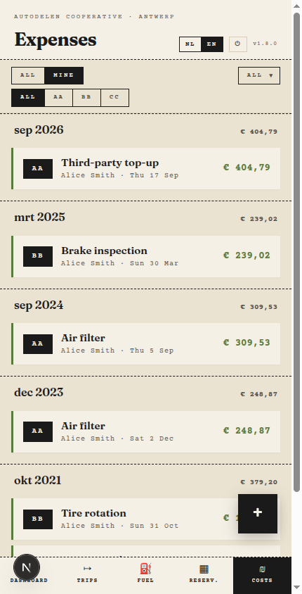

---

## 7. Adding data with the FAB

The **FAB** (Floating Action Button) is the **+** button at the bottom-right of the screen. It is the fastest way to log new information.

Tap the FAB to expand it. On the dashboard it shows all options; on individual pages it shows the relevant action for that page.

---

## 8. Adding a new trip

Tap the FAB → **Add trip** (or use the button on the Trips page).

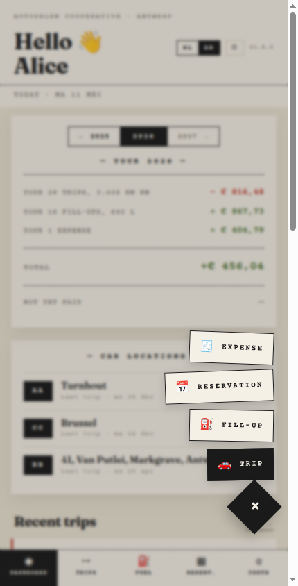

Fill in the form:

| Field            | Description                                                        |
| ---------------- | ------------------------------------------------------------------ |
| **Car**          | Which car was driven                                               |
| **Date**         | Date of the trip                                                   |
| **Driver**       | Who drove (defaults to you)                                        |
| **Start km**     | Odometer reading at the start of the trip                          |
| **End km**       | Odometer reading at the end (distance is calculated automatically) |
| **Parking note** | Optional note about where the car is parked                        |

Tap **Save**. The trip appears immediately in the list.

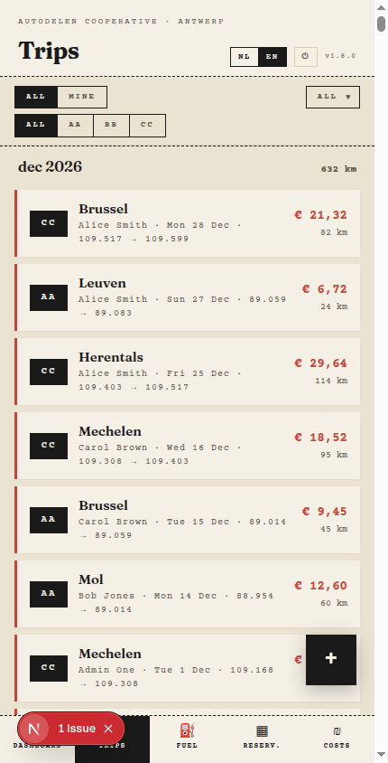

---

## 9. Adding a fuel entry

Tap the FAB → **Add fuel** (or use the button on the Fuel page).

Fill in the form:

| Field          | Description                                                        |
| -------------- | ------------------------------------------------------------------ |
| **Car**        | Which car was refuelled                                            |
| **Date**       | Date of the fill-up                                                |
| **Driver**     | Who paid at the pump (defaults to you)                             |
| **Amount (€)** | Total amount paid                                                  |
| **Litres**     | Amount of fuel added (price per litre is calculated automatically) |

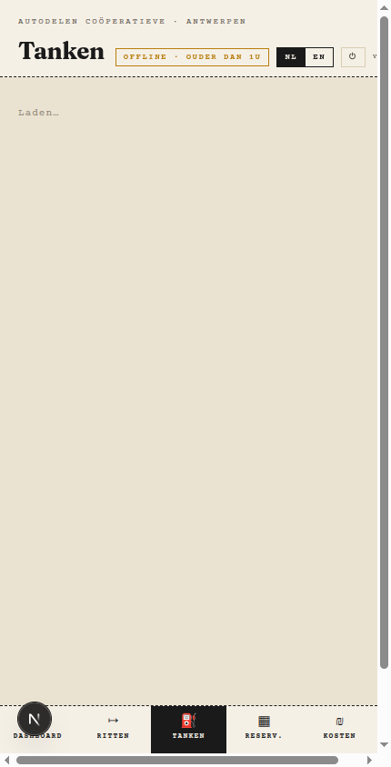

Tap **Save**. The entry appears on the Fuel page and is included in cost calculations.

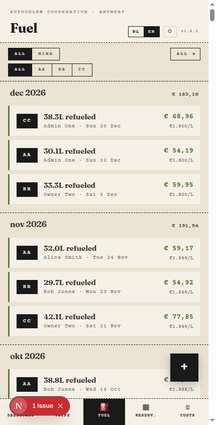
