# End-user Guide

This guide walks you through using the car sharing app as a member — from accepting your invite to logging trips and managing reservations.

> Looking for the car owner documentation? See the [Owner Guide](owner-guide.md).

---

## 1. Accepting your invite

The car owner sends you a personal invite link by email or message. The link looks like:

```
/invite/a3f2c1d4e5b6...
```

Click the link to open the app. You will land on a **Set password** screen.

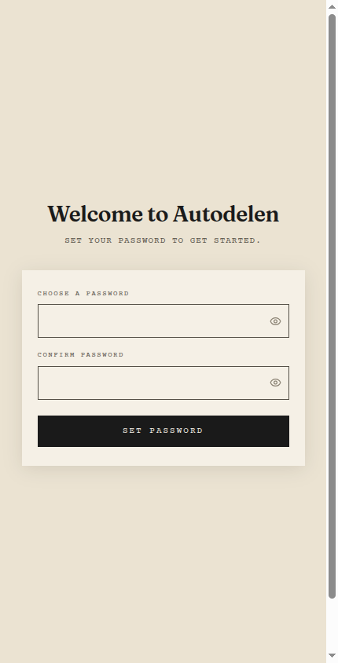

Choose a password (minimum 8 characters), confirm it, and click **Set password**. You are logged in immediately and land on your profile page to fill in your details.

---

## 2. Setting up your profile

After logging in, hover over your **name** in the top-right corner of any page to reveal the pencil icon, then click it.

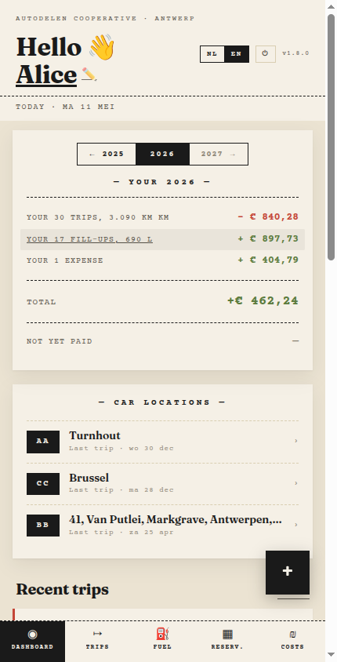

Fill in two required fields:

| Field                   | Why it matters                                 |
| ----------------------- | ---------------------------------------------- |
| **Email address**       | Used for settlement notifications              |
| **Bank account (IBAN)** | Used to send or receive payments at settlement |

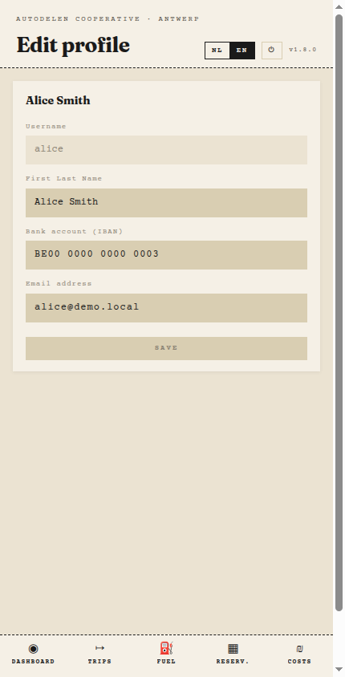

Save your changes. You can update these at any time.

---

## 3. Dashboard

The dashboard is your home page. It shows an overview of all cars you have access to.


The dashboard contains:

- **Balance** — your running cost balance across all cars
- **Car locations** — where each car is currently parked
- **Recent trips, fuel, and expenses** — the latest entries with an **All** link to the full page
- **Upcoming reservations** — your next confirmed and pending reservations

### Year summary

Scroll down to see a breakdown by year — total distance driven, fuel cost, and your share of expenses.

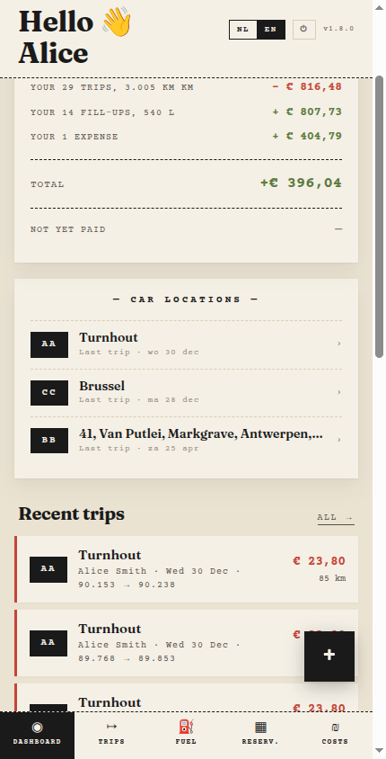

---

## 4. Trips page

The trips page lists all recorded drives.


### Filters

| Filter   | Description                 |
| -------- | --------------------------- |
| **Car**  | Show trips for one car only |
| **Year** | Limit to a specific year    |
| **Mine** | Show only your own trips    |

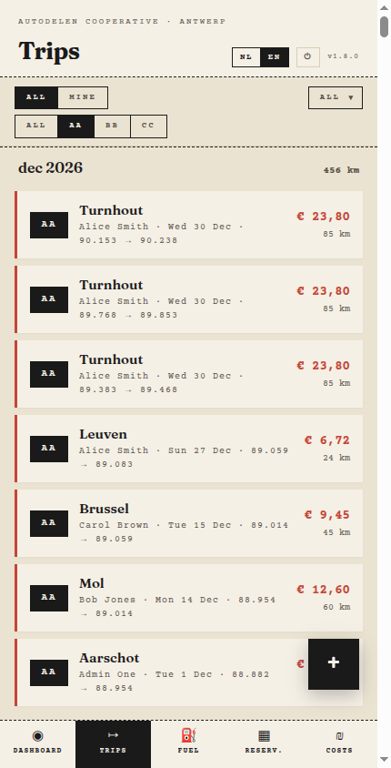

Each trip card shows: destination, driver, date, odometer range, and cost. Click a trip to view and edit its details.


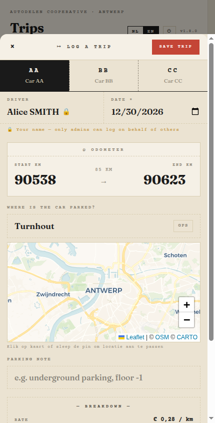

---

## 5. Fuel page

The fuel page lists all recorded fill-ups.

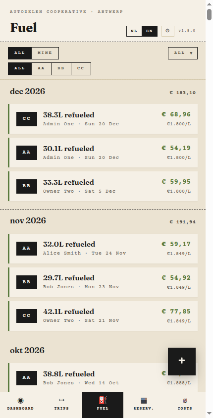

### Filters

| Filter   | Description                        |
| -------- | ---------------------------------- |
| **Car**  | Show fuel entries for one car only |
| **Year** | Limit to a specific year           |
| **Mine** | Show only fill-ups you paid for    |

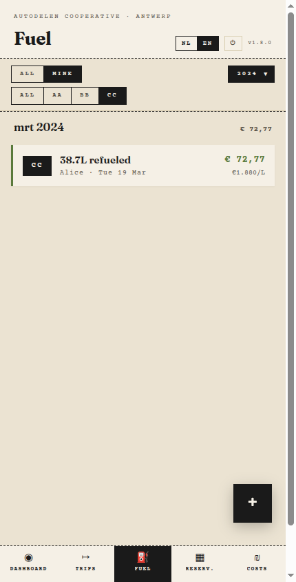

Each fuel entry shows: date, car, litres, price per litre, total cost, and who paid. Click an entry to view and edit its details.

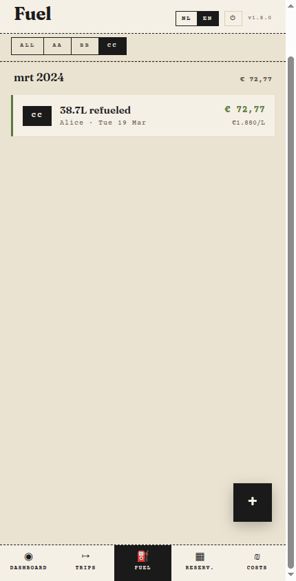

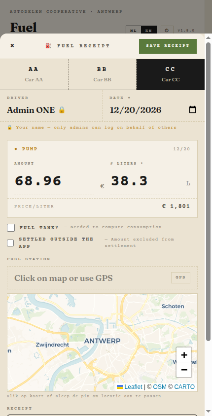

---

## 6. Expenses page

The expenses page lists all one-off costs — parking fees, maintenance contributions, accessories, and other shared costs.


### Filters

| Filter   | Description                        |
| -------- | ---------------------------------- |
| **Car**  | Show expenses for one car only     |
| **Mine** | Show only your own expense entries |
| **Year** | Limit to a specific year           |

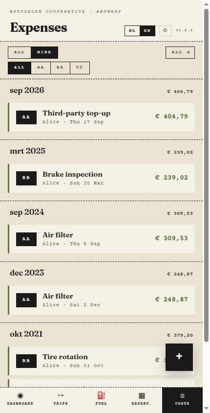

Each expense card shows: date, car, amount, description, and category. Click an expense to view and edit its details.

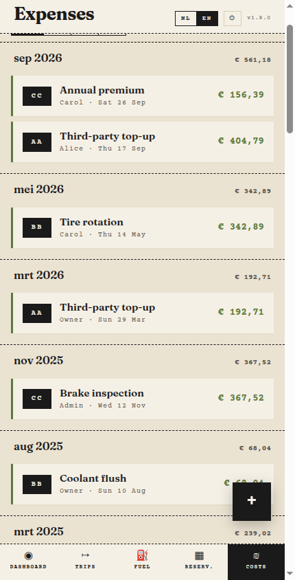

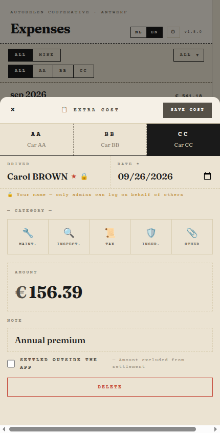

---

## 7. Reservations

The reservations page lets you request dates for a car in advance. The car owner confirms or rejects requests.


The timeline uses these indicators:

| Symbol | Meaning               |
| ------ | --------------------- |
| □      | Day is available      |
| ▦      | Pending reservation   |
| ■      | Confirmed reservation |

### Viewing and editing a reservation

Tap any reservation card in the Upcoming list to open it. You can change the dates, car, or note — or cancel the reservation.

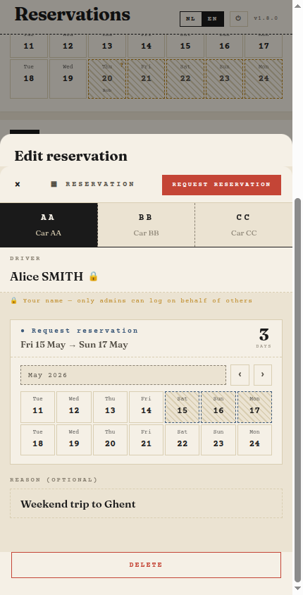

### Creating a reservation

There are three ways to open the reservation form:

**1. FAB button** — tap the **+** button at the bottom-right of any page and choose **Add reservation**. The form opens with no dates selected.

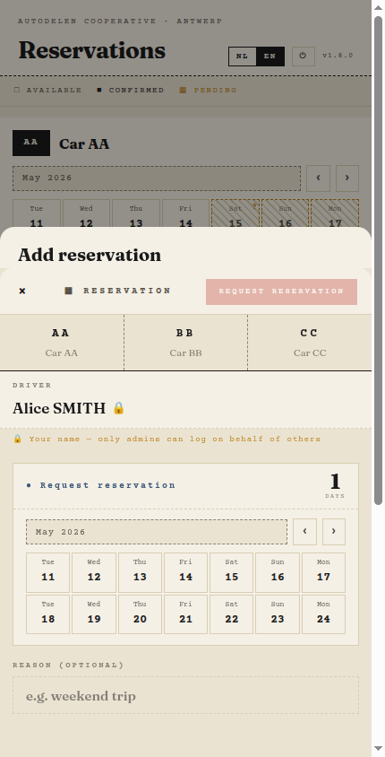

**2. "+ Add reservation" button** — tap the button in the Upcoming list header. Same as the FAB: no dates pre-filled.

**3. Calendar pick** — tap a day in the per-car timeline to start a range; tap the end day. The form opens with those dates already filled in.

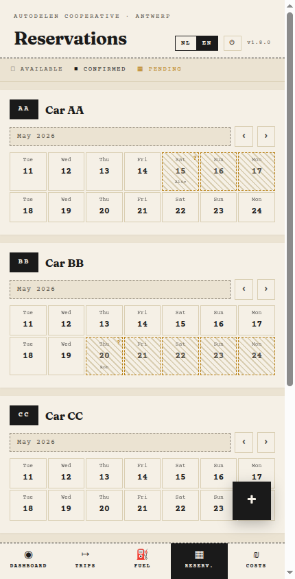

### Overlapping reservations

If you select dates that overlap an existing reservation for the same car, a warning appears. You can still submit — the owner sees the overlap and decides.


### Reservation status

| Status        | Meaning                                          |
| ------------- | ------------------------------------------------ |
| **Pending**   | Submitted, waiting for owner to confirm          |
| **Confirmed** | Owner approved — the car is yours on those dates |
| **Rejected**  | Owner declined                                   |

Pending reservations appear with an amber indicator; confirmed ones appear in black.

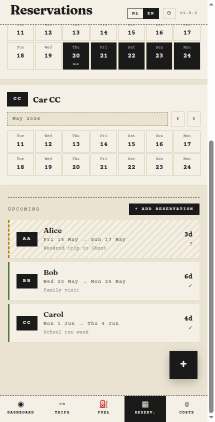

---

## 8. Adding data with the FAB

The **FAB** (Floating Action Button) is the **+** button at the bottom-right of the screen. It is the fastest way to log new information.

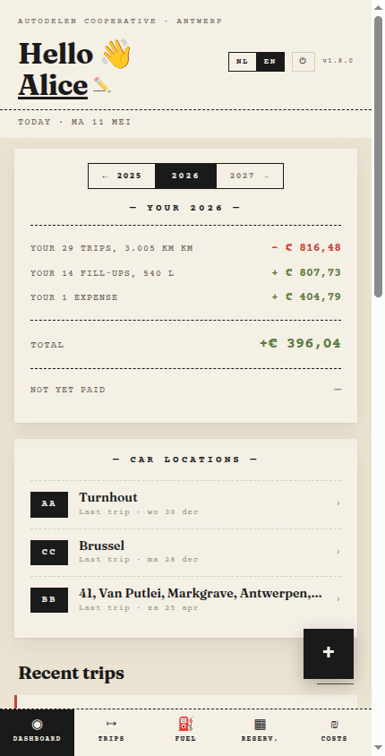

Tap the FAB to expand it. On the dashboard it shows all options; on individual pages it shows the action relevant to that page.

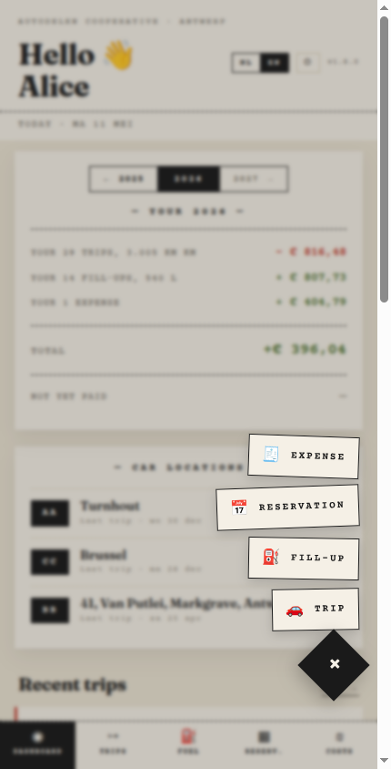

---

### 8.1 Adding a new trip

Tap the FAB → **Add trip** (or use the button on the Trips page).

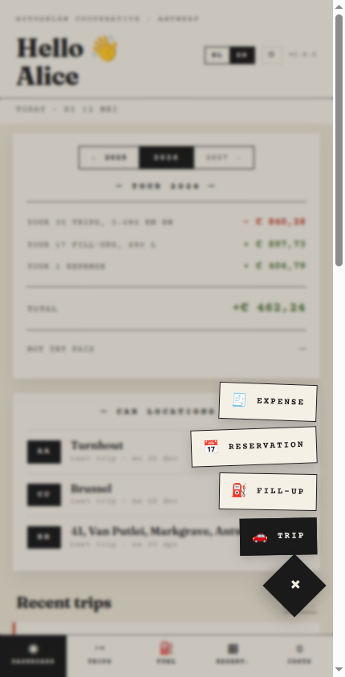

Fill in the form:

| Field            | Description                                                        |
| ---------------- | ------------------------------------------------------------------ |
| **Car**          | Which car was driven                                               |
| **Date**         | Date of the trip                                                   |
| **Driver**       | Who drove (defaults to you)                                        |
| **Start km**     | Odometer reading at the start of the trip                          |
| **End km**       | Odometer reading at the end (distance is calculated automatically) |
| **Parking note** | Optional note about where the car is parked                        |

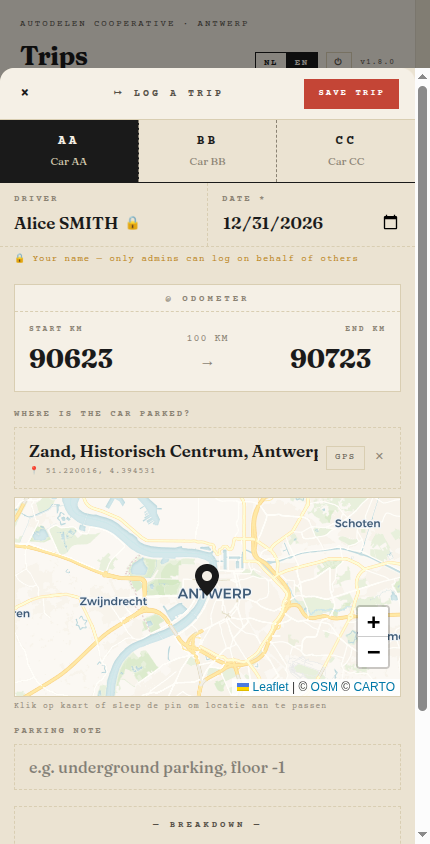

Tap **Save**. The trip appears immediately in the list.

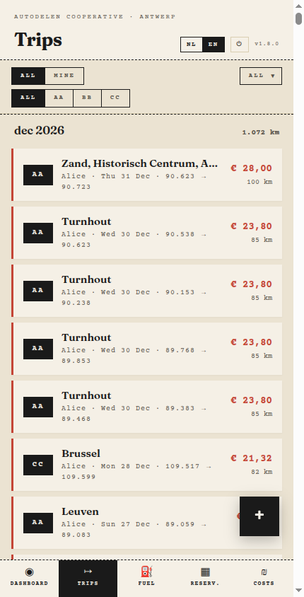

---

### 8.2 Adding a fuel entry

Tap the FAB → **Add fuel** (or use the button on the Fuel page).

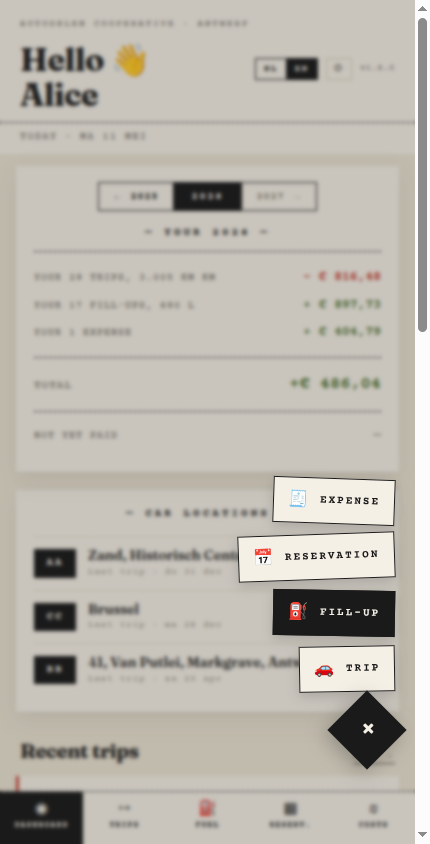

Fill in the form:

| Field          | Description                                                        |
| -------------- | ------------------------------------------------------------------ |
| **Car**        | Which car was refuelled                                            |
| **Date**       | Date of the fill-up                                                |
| **Driver**     | Who paid at the pump (defaults to you)                             |
| **Amount (€)** | Total amount paid                                                  |
| **Litres**     | Amount of fuel added (price per litre is calculated automatically) |

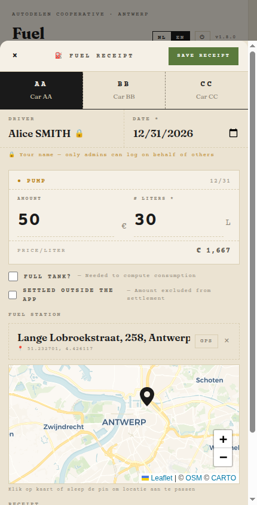

Tap **Save**. The entry appears on the Fuel page and is included in cost calculations.

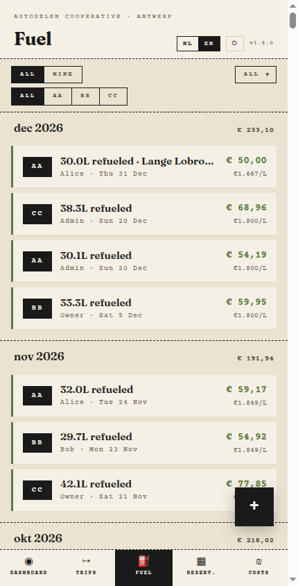

---

### 8.3 Adding an expense

Tap the FAB → **Add expense** (or use the button on the Expenses page).

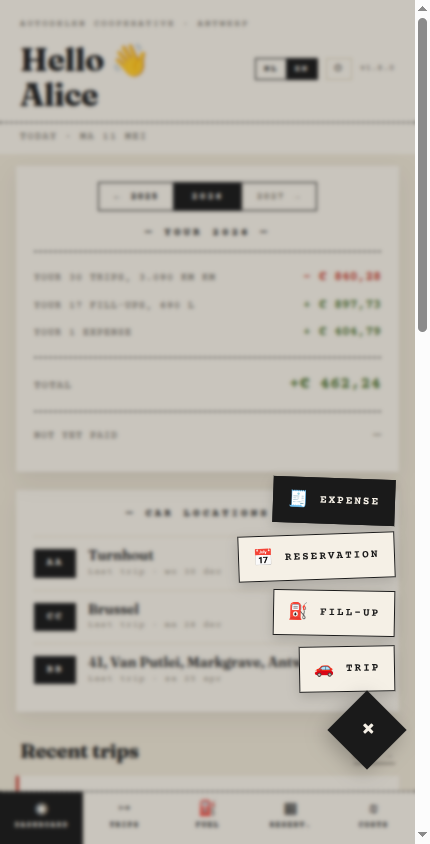

Fill in the form:

| Field           | Description                                  |
| --------------- | -------------------------------------------- |
| **Car**         | Which car the expense relates to             |
| **Date**        | Date of the expense                          |
| **Amount (€)**  | Total amount paid                            |
| **Description** | What the expense was for                     |
| **Category**    | Type of expense (parking, maintenance, etc.) |

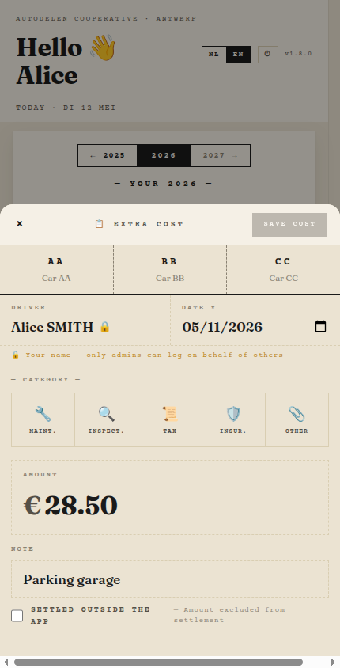

Tap **Save**. The entry appears on the Expenses page and is included in settlement calculations.


---

### 8.4 Adding a reservation

Tap the FAB → **Add reservation** (or use the button on the Reservations page).

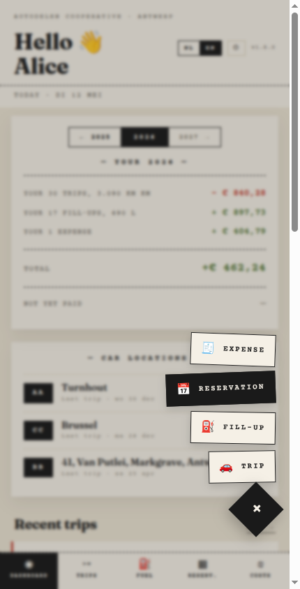

The reservation form opens with no dates selected. Select a date range using the calendar grid, choose the car, add an optional note, and tap **Request** (or **Confirm** if you are an admin).

The car owner will be notified and can confirm or reject the request.

> See [Section 7](#7-reservations) for a full description of the form, calendar pick flow, and reservation statuses.
